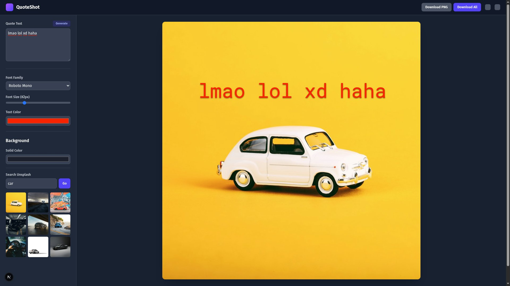

> **⚠️ Project Archived: This project is no longer under active development.**
>
> This repository is kept for historical and educational purposes. The live demo may be taken down at any time. Thank you for your interest!

# ✨ QuoteShot

> Because your brilliant thoughts deserve to look better than a default tweet.

Quoteshot is a fast, focused, and frictionless web application for creating beautiful quote cards in seconds. Perfect for your Instagram story, X feed, or just for yourself.

**[➡️ Live Demo\!](https://quoteshot-v1.vercel.app)**

__

---

## 🎯 About This Project & The Pivot

This project was built as a personal challenge to create a polished, real-world application from scratch. The goal was to go beyond a simple to-do list and build a delightful, useful tool that could serve as the foundation for a full-fledged SaaS product. `QuoteShot` was a success in that regard—it taught me invaluable lessons about product design, development, and shipping.

However, the most critical lesson I learned was about **founder-market fit**. Building for a general audience is tough; building for an audience you are a part of gives you an unfair advantage.

For that reason, I have made the strategic decision to archive `QuoteShot` and go all-in on a new mission that I am deeply passionate about: **`CodeCompass`**, an AI-powered learning engine designed to help developers like myself navigate their careers.

The journey building `quoteshot` was the perfect training ground. Now, the main event begins. You can follow my journey building `CodeCompass` in public on **[X @bit2swaz](https://x.com/bit2swaz)**.

### ✅ Key Features (MVP)

- **Responsive Landing Page:** A fully animated, modern landing page to attract users.
- **Dynamic Canvas:** A powerful editor to design your quote card.
- **Draggable Text:** Easily position your text exactly where you want it.
- **Live Style Editing:** Change fonts, colors, and sizes in real-time.
- **Dynamic Backgrounds:** Choose from solid colors or search millions of high-quality images from Unsplash.
- **Resolution Presets:** Start with pre-defined sizes for social media posts and stories.
- **One-Click Export:** Download your creation as a high-quality PNG or get all preset sizes in a single ZIP file.
- **State Persistence:** Your last design is automatically saved in your browser, so you can pick up right where you left off.

### 🛠️ Built With

- **Framework:** [Next.js](https://nextjs.org/) (React)
- **Styling:** [Tailwind CSS](https://tailwindcss.com/)
- **App Scaffolding:** [T3 Stack](https://create.t3.gg/)
- **State Management:** [Zustand](https://github.com/pmndrs/zustand)
- **Canvas & Graphics:** [Konva.js](https://konvajs.org/) & [react-draggable](https://github.com/react-grid-layout/react-draggable)
- **Image Export:** [html-to-image](https://github.com/bubkoo/html-to-image)
- **Deployment:** [Vercel](https://vercel.com/)

---

## 🚀 Getting Started

To get a local copy up and running, follow these simple steps.

### Prerequisites

- Node.js (v18 or later)
- pnpm

### Installation

1.  **Clone the repo**
    `sh
    git clone [https://github.com/bit2swaz/quoteshot-v1.git](https://github.com/bit2swaz/quoteshot-v1.git)
    `
2.  **Install PNPM packages**
    `sh
    pnpm install
    `
3.  **Set up your environment variables**
    - Create a file named `.env.local` in the root of the project.
    - Get a free API key from [Unsplash Developers](https://unsplash.com/developers).
    - Add your key to the `.env.local` file:
      `      NEXT_PUBLIC_UNSPLASH_ACCESS_KEY='your_unsplash_access_key'
     `
4.  **Run the development server**
    `sh
    pnpm dev
    `
    Open [http://localhost:3000](http://localhost:3000) to view it in the browser.

---

## 🤝 A Note on Contributions

As this project is now archived, I am no longer accepting new contributions or pull requests. Thank you to everyone who showed interest. The best way to contribute now is to follow and support the journey with `CodeCompass`.

---

## 📄 License

Distributed under the MIT License. See `LICENSE` for more information.

---

## ♥️ Acknowledgements

Made with ❤️ by [**bit2swaz**](https://github.com/bit2swaz).
